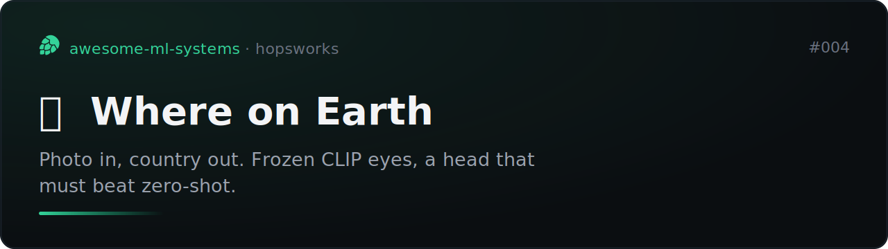
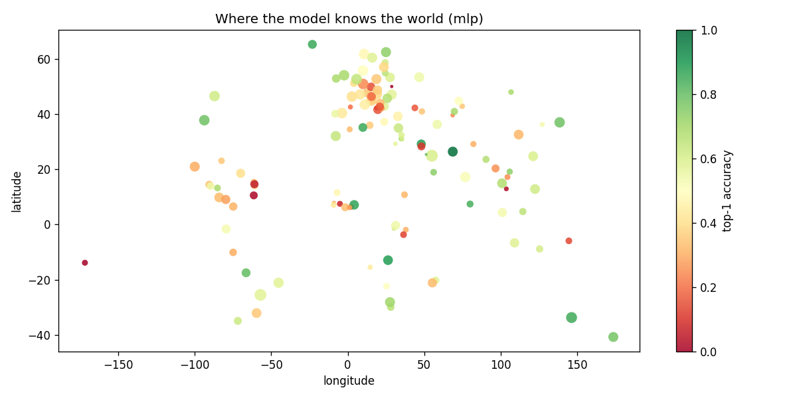
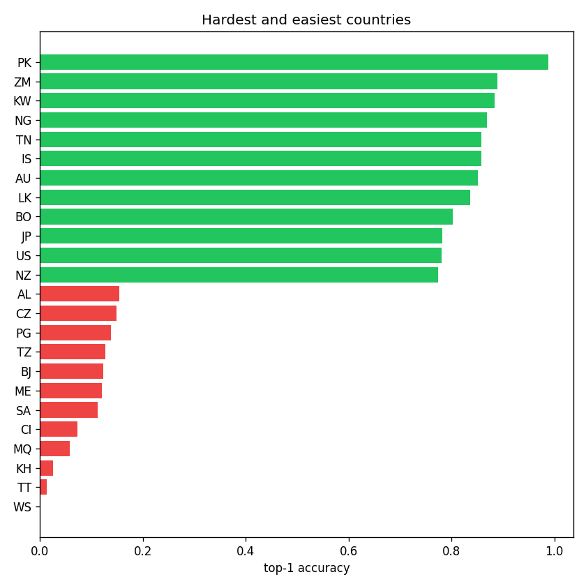
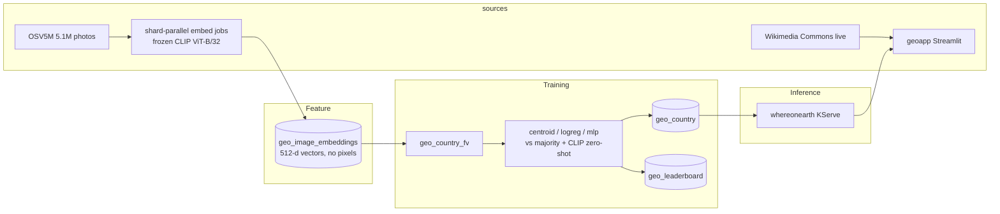

# Where on Earth



[](https://github.com/MagicLex/awesome-ml-systems)
[](https://www.hopsworks.ai/)

Which country was a photo taken in? A frozen CLIP ViT-B/32 turns the photo into
512 numbers, a head trained on OSV5M street view turns the numbers into one of 200+
countries, and the head has to beat CLIP zero-shot ("a photo taken in France", no
training at all) to justify existing.

## The result

Landing: the embed fleet and training run are in flight. This section gets the
held-out top-1/top-5 table (heads vs majority-class vs CLIP zero-shot) and the
accuracy world map when they finish.

| metric | value |
|---|---:|
| top-1 (held-out cells) | pending |
| top-5 (held-out cells) | pending |
| CLIP zero-shot top-1 (the bar to clear) | pending |




## Caveats

Read these before quoting the number anywhere.

- **Country-level only, by design.** This does not and will not locate a street,
  a building, or a person. See [docs/HONESTY.md](docs/HONESTY.md).
- **Selection.** OSV5M is Mapillary street view: dashcams and phones on roads.
  Strong on roadscapes; weaker on interiors, food, portraits, and anywhere
  Mapillary coverage is thin. A per-country cap deliberately trades US/EU
  accuracy for global coverage.
- **Split by place, not by row.** Train/test are separated by OSV5M quadtree
  cell, so two frames of the same street never sit on both sides. Row-level
  splits on street imagery are how fake accuracy gets made.
- **The backbone is frozen.** Nothing fine-tunes. Heads train on stored vectors
  in minutes on CPU; the trade is a ceiling on what pixels can say.

## Architecture

An FTI (feature, training, inference) system on Hopsworks. Images become vectors
at the door: the embed jobs stream OSV5M zip shards (2.5 GB each), embed what
survives the cap, and delete the pixels. The feature group stores 512 floats and a
label per photo -- nobody ever re-embeds.



The file-by-file map:

```
collect/slim_metadata.py     2.9 GB CSV -> 5M-row parquet             (terminal, I/O)
pipelines/embed_pipeline.py  zip shards -> CLIP vectors parquet       (3 parallel jobs)
pipelines/insert_fg.py       vectors -> feature group + feature view  (terminal)
pipelines/train.py           heads vs baselines -> model registry     (Hopsworks job)
serving/predictor.py         photo -> same embed module -> country    (KServe)
app/app.py                   upload / play-vs-model / honesty tab     (Hopsworks app)
embed_features.py            shared CLIP embedding (no train/serve skew)
```

## Reproduce

Clone into a Hopsworks project on the `/hopsfs/...` FUSE mount.

```bash
curl -o data/train.csv https://huggingface.co/datasets/osv5m/osv5m/resolve/main/train.csv
curl -o data/test.csv  https://huggingface.co/datasets/osv5m/osv5m/resolve/main/test.csv
make meta            # slim the CSVs
make embed-fleet     # 3 parallel embed jobs over disjoint zip shards
make prompts-job     # CLIP text embeddings of all 222 countries
make insert          # vectors -> FG + FV
make train-job       # heads vs baselines -> registry
make serve           # whereonearth KServe endpoint
make app             # geoapp Streamlit front-end
```

No GPU required anywhere: embedding is shard-parallel CPU jobs, heads are
sklearn on vectors, serving embeds one photo per request.

## The demo

Upload a photo and get a country distribution, or play a round against the model
on a random geotagged Wikimedia Commons photo -- it guesses, then the map reveals
the truth. The honesty tab shows the leaderboard including the baselines.
